# legend-game-hack
legend dos game(金庸群侠传 DOS) hack for macOS

###### **Edit Game**
 
Character Save File

Z.dat File

change main character's name(big5)

change main character's home name(big5)

change main character's position

change merchant's position

main character data modify

team member list modify

attack list modify

venom algorithm modify

**big chagne**

add features that can reset battle events to re-challenge those big events

etc.

stay tuned.

###### **External Lib**

zhconv - used for convert simple chinese to traditional chinese

##### **How to use**

Download install/dmg
[金庸群侠传DOS版修改器.dmg](https://github.com/xinasuka/lengend-game-hack/raw/main/install/%E9%87%91%E5%BA%B8%E7%BE%A4%E4%BE%A0%E4%BC%A0DOS%E7%89%88%E4%BF%AE%E6%94%B9%E5%99%A8.dmg)

Install app

Open app

Done.

# Legend Game Hack
Here're some screenshots:

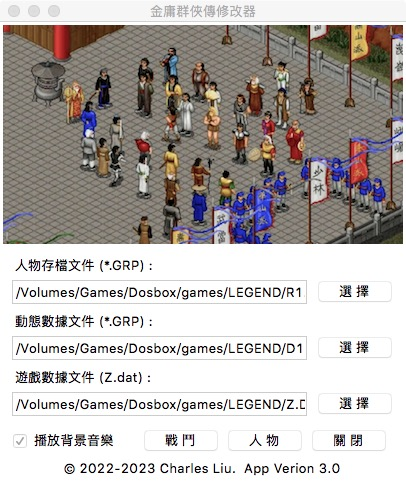
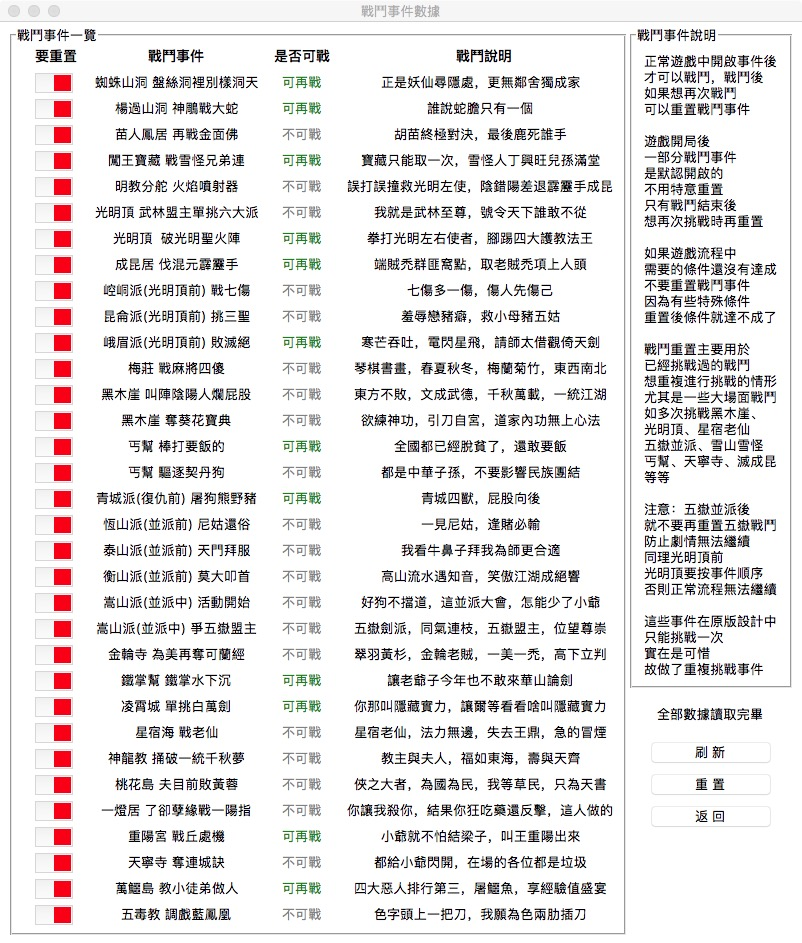
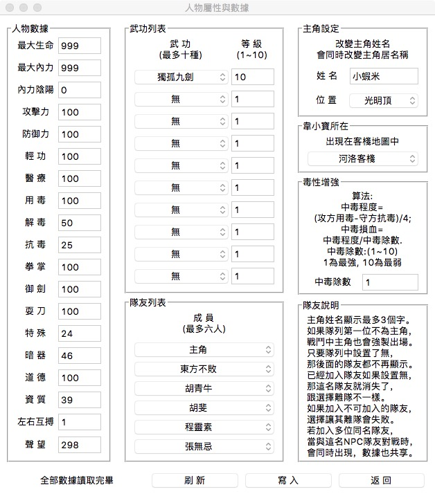
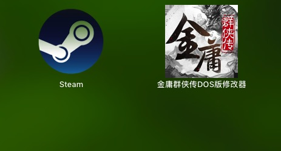
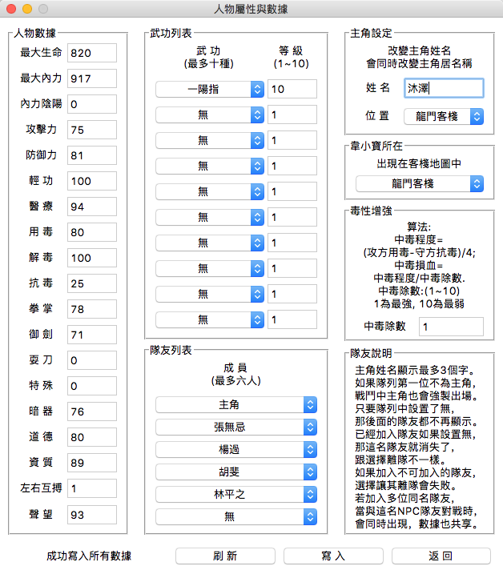
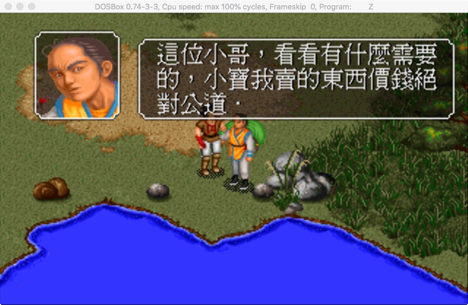
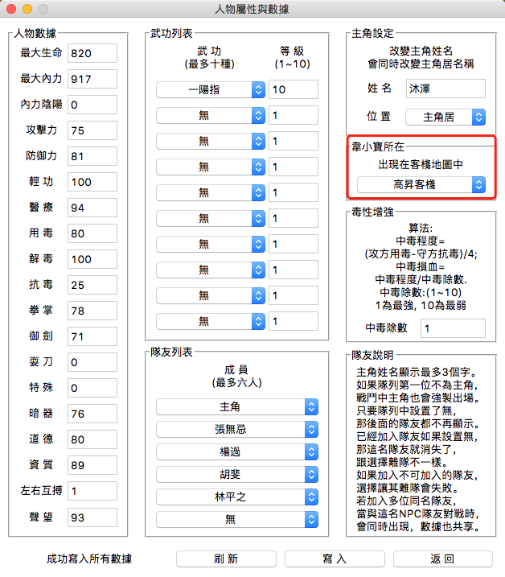
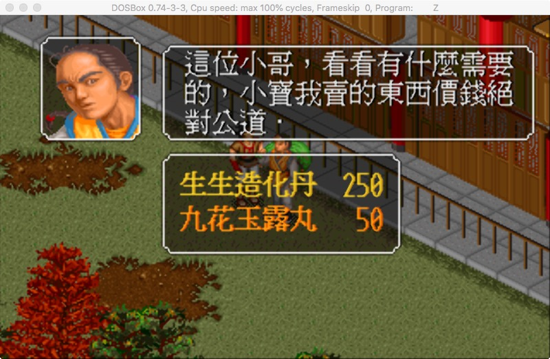
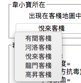
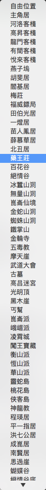
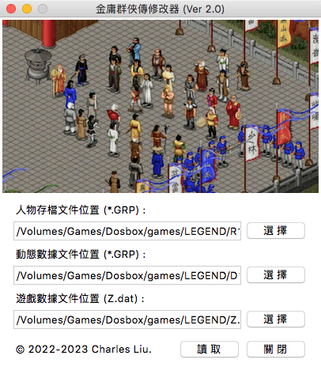
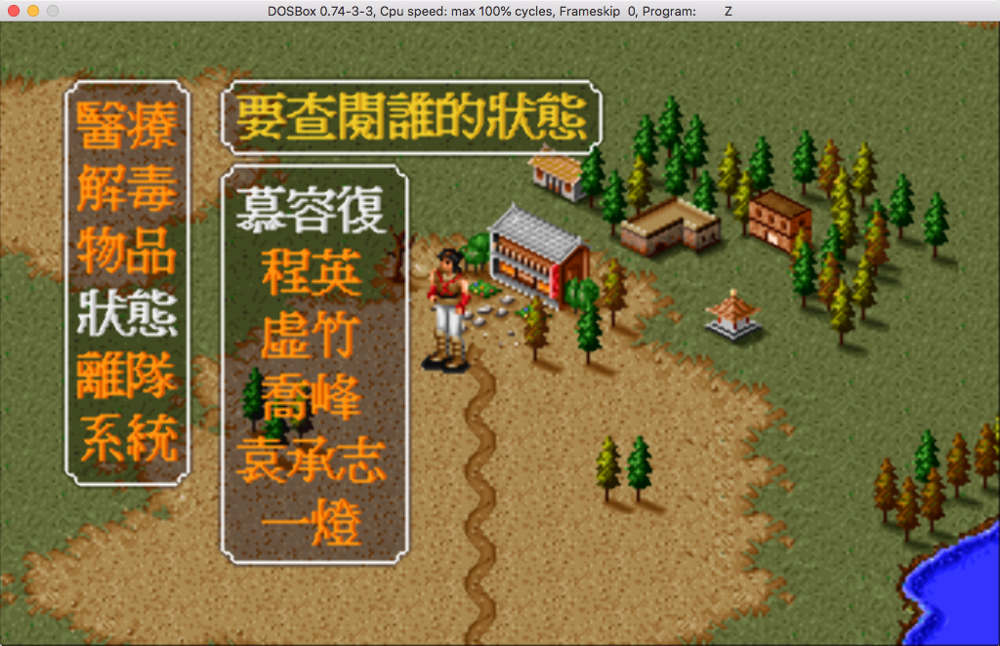
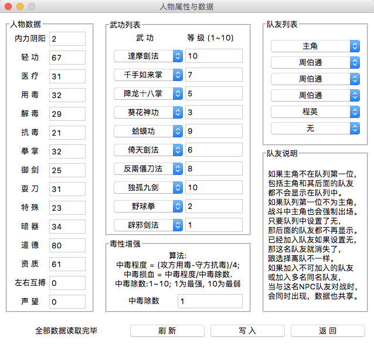
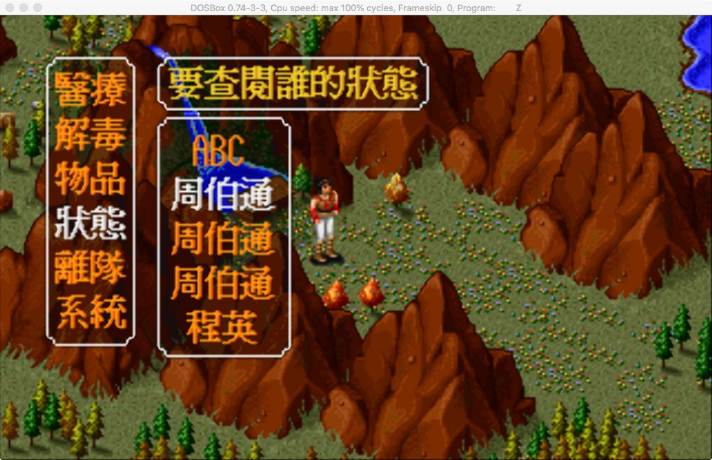
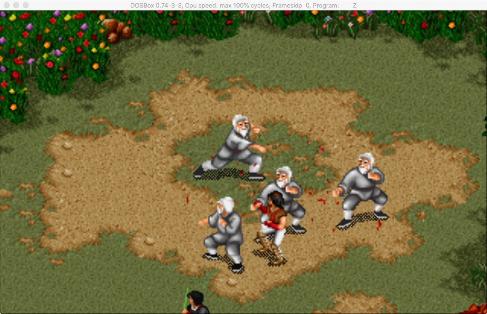
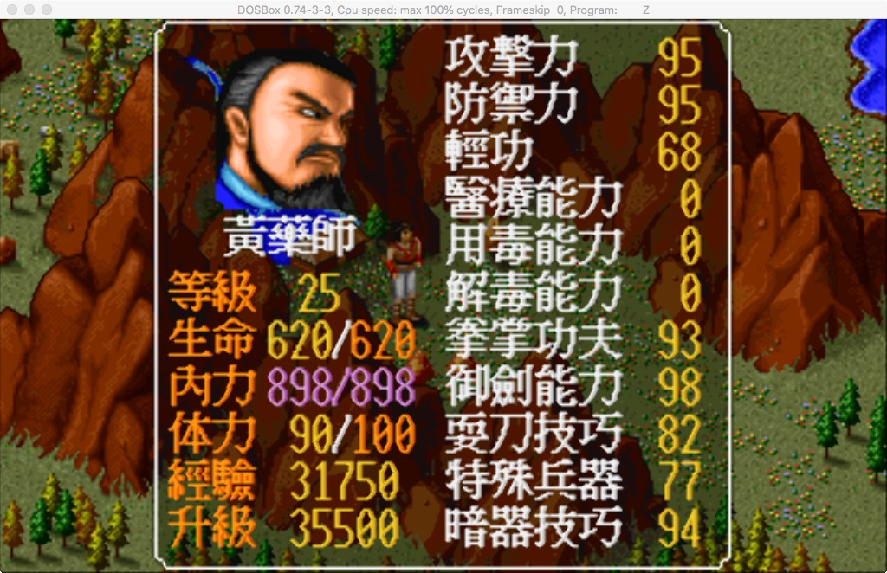
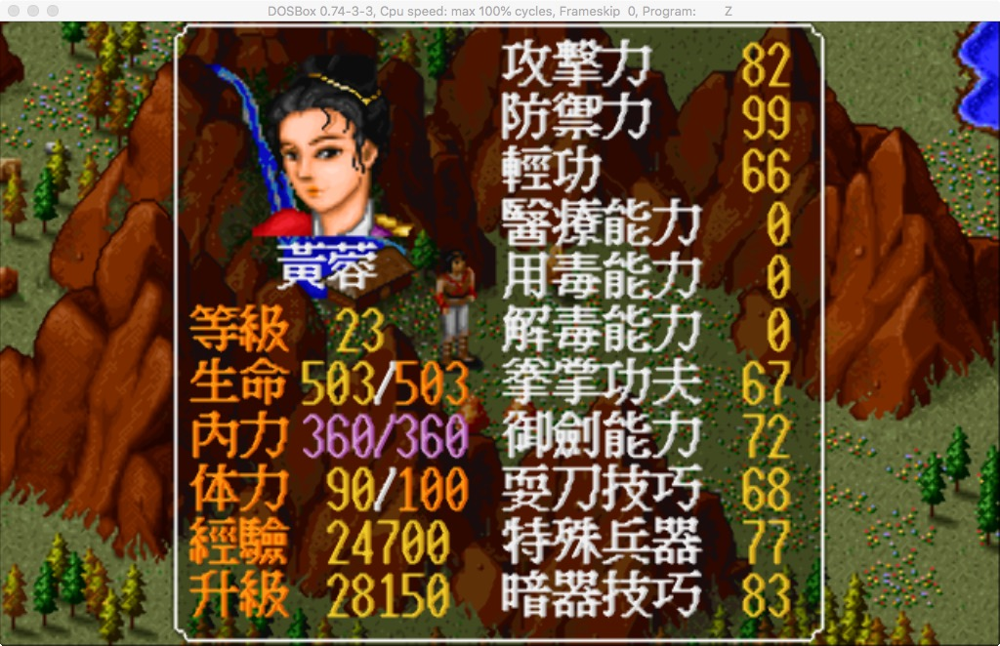
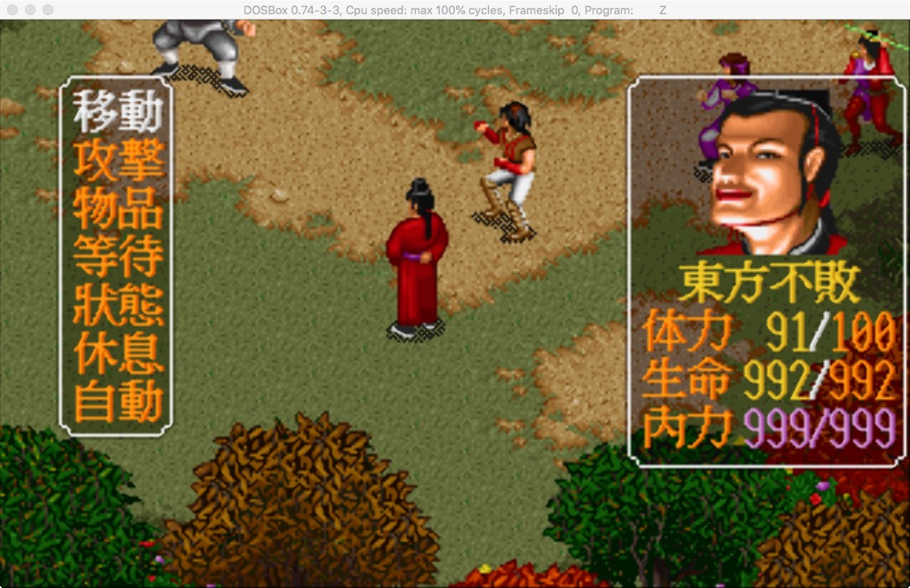
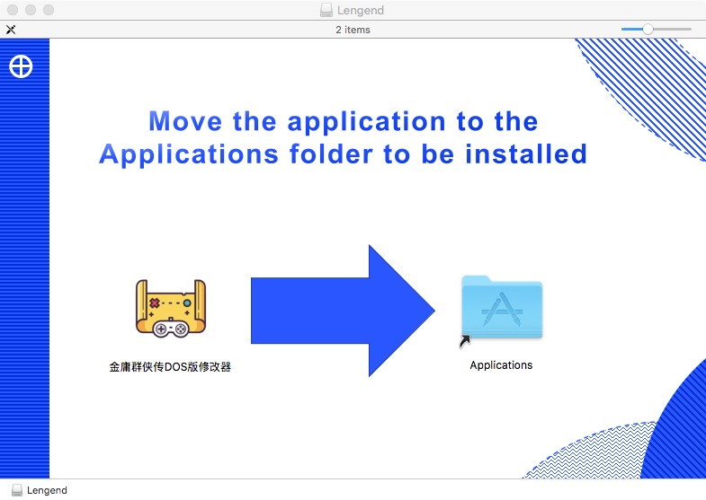
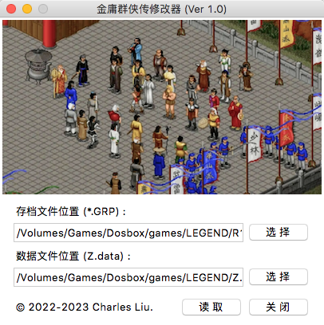